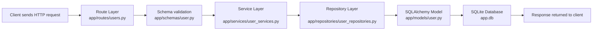

# FastAPI Learn

This project is a beginner-friendly FastAPI application designed to teach the basics of building a backend API with:

- FastAPI
- SQLAlchemy ORM
- SQLite database
- Pydantic validation
- Layered architecture (routes, services, repositories, models)

It is intentionally simple, but it follows a clean backend structure that students can use as a foundation for building larger applications.

---

## Project Goal

The main goal of this project is to show how a request flows from the API layer to the database and back.

In this example, the API allows a student to create a user record in the database.

---

## Tech Stack

- Python
- FastAPI
- SQLAlchemy
- SQLite
- Pydantic

---

## Project Structure

```text
FastAPI-Learn/
├── app/
│   ├── main.py
│   ├── db/
│   │   ├── base.py
│   │   └── session.py
│   ├── models/
│   │   └── user.py
│   ├── repositories/
│   │   └── user_repositories.py
│   ├── routes/
│   │   └── users.py
│   ├── schemas/
│   │   └── user.py
│   └── services/
│       └── user_services.py
├── app.db
├── venv/
└── README.md
```

### Folder explanation

#### app/main.py
This is the entry point of the application.

- Creates the FastAPI app
- Includes the user routes
- Creates the database tables automatically using SQLAlchemy metadata

#### app/db/base.py
This defines the base SQLAlchemy model class.

All ORM models inherit from this base class.

#### app/db/session.py
This file handles database connection setup.

- Creates the SQLite database engine
- Creates the database session factory
- Provides the `get_db()` dependency used by routes

#### app/models/user.py
This is the database model for the `users` table.

It defines the columns:

- `id`
- `username`
- `email`
- `age`

#### app/schemas/user.py
This file contains request validation models using Pydantic.

The `UserCreate` schema ensures that incoming data follows the expected structure before it reaches the logic layer.

#### app/repositories/user_repositories.py
This layer is responsible for direct database operations.

It handles creating and saving records in the database.

#### app/services/user_services.py
This layer contains business logic.

It receives data from the route and calls the repository to perform the database operation.

#### app/routes/users.py
This file contains the API endpoints.

It defines HTTP routes and connects them with the service layer.

---

## Request Flow in the Project

The architecture follows a common backend pattern:



### Step-by-step flow

1. The client sends a request to the API.
2. The route is matched in `app/routes/users.py`.
3. The request body is validated by the Pydantic schema.
4. The route calls a service function.
5. The service calls the repository function.
6. The repository creates a `User` model instance.
7. SQLAlchemy writes the data into the SQLite database.
8. The database returns the inserted record.
9. The API sends the result back to the client.

---

## Actual API Endpoint

This project currently includes one endpoint:

### Create a user

- Method: `POST`
- Path: `/users/`

#### Request body example

```json
{
  "username": "alice",
  "email": "alice@example.com",
  "age": 25
}
```

#### Example with curl

```bash
curl -X POST "http://127.0.0.1:8000/users/" \
  -H "Content-Type: application/json" \
  -d '{
    "username": "alice",
    "email": "alice@example.com",
    "age": 25
  }'
```

---

## How the Database is Created

In `app/main.py`, the project runs:

```python
Base.metadata.create_all(bind=engine)
```

This automatically creates the database tables from the SQLAlchemy models when the app starts.

Because the database URL is:

```python
sqlite:///./app.db
```

SQLite creates a file named `app.db` in the project root.

---

## Why this project is structured this way

This project follows a clean layered architecture:

- Routes handle HTTP requests
- Services handle business logic
- Repositories talk to the database
- Models describe the database tables
- Schemas validate request payloads

This makes the project easier to understand, test, and extend as the application grows.

---

## How to Run the Project

### 1. Create a virtual environment

```bash
python -m venv venv
```

### 2. Activate the virtual environment

On Windows:

```bash
venv\Scripts\activate
```

On macOS/Linux:

```bash
source venv/bin/activate
```

### 3. Install dependencies

```bash
pip install fastapi uvicorn sqlalchemy
```

### 4. Start the app

```bash
uvicorn app.main:app --reload
```

Then open:

```text
http://127.0.0.1:8000
```

---

## Important Files to Study First

If you are learning from this project, these are the best files to read in order:

1. `app/main.py` — app startup and database creation
2. `app/routes/users.py` — API endpoint definitions
3. `app/schemas/user.py` — request validation
4. `app/services/user_services.py` — business logic
5. `app/repositories/user_repositories.py` — database insert logic
6. `app/models/user.py` — database table definition
7. `app/db/session.py` — database session setup

---

## Learning Summary

This project teaches the basic building blocks of a FastAPI backend:

- how to define a route
- how to validate incoming data
- how to connect route logic to services
- how to separate database logic from business logic
- how to map Python classes to database tables
- how to save data into SQLite with SQLAlchemy

---

## Next Ideas for Students

Once you understand this project, you can extend it with:

- `GET /users/` to read all users
- `GET /users/{id}` to fetch one user
- `PUT /users/{id}` to update a user
- `DELETE /users/{id}` to remove a user
- authentication and login
- user profile images
- database migrations
- tests for the API

---

## Conclusion

This project is a simple but effective example of a layered FastAPI backend.

It helps students understand how a real API is organized and how data moves from the client to the database and back.

By studying this structure, you will be better prepared to build more advanced and scalable backend applications.
